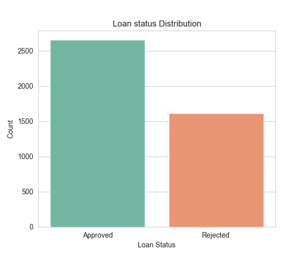
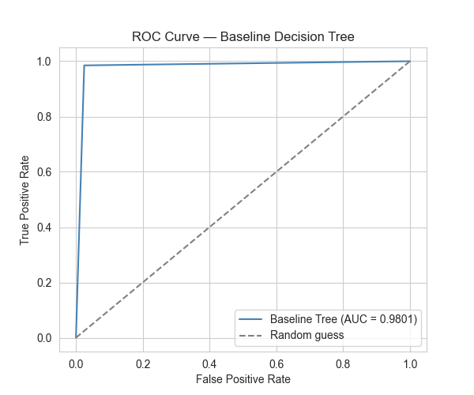
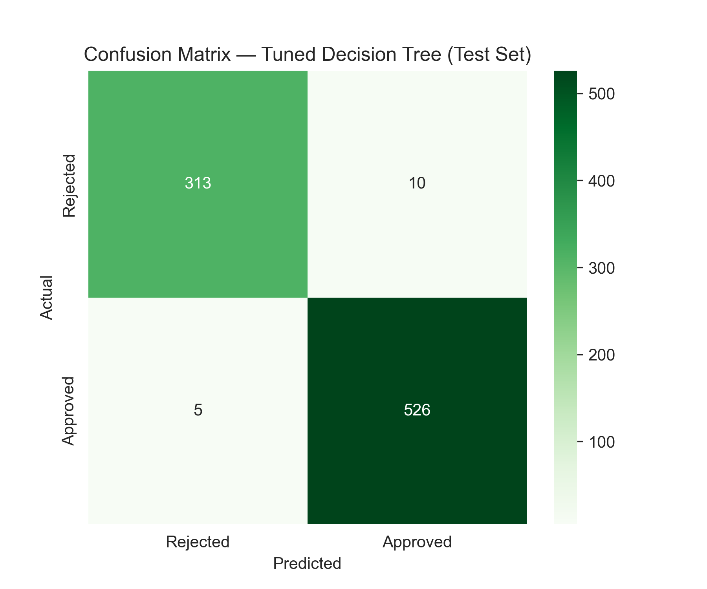
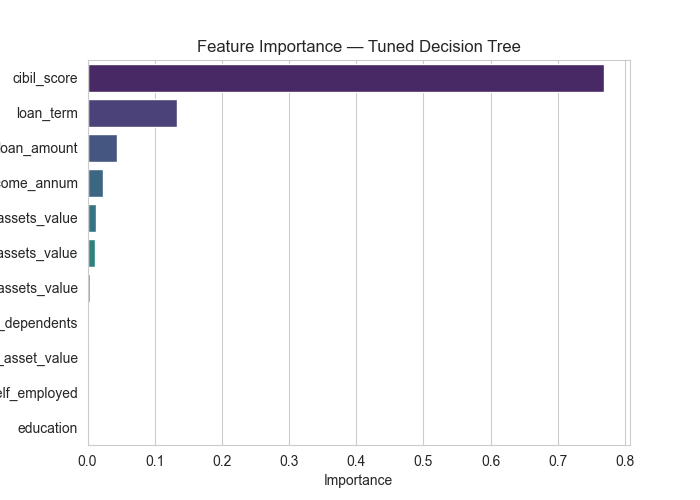
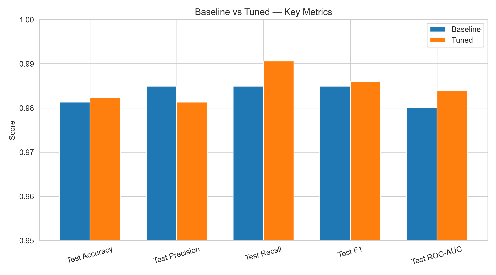
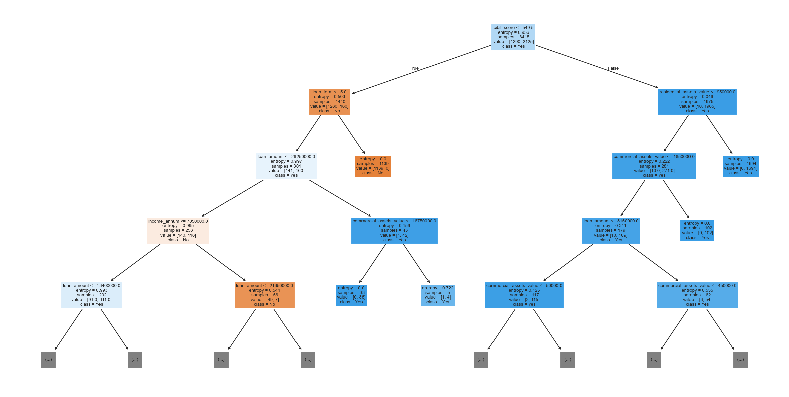

# Loan Approval Prediction — Decision Tree Classifier

Predicting whether a loan application will be **Approved** or **Rejected** using a Decision Tree, from applicant financial and demographic data — comparing a baseline tree against a hyperparameter-tuned version and identifying the key drivers of approval.

## Dataset

- **Source:** [Loan Approval Prediction Dataset](https://www.kaggle.com/datasets/architsharma01/loan-approval-prediction-dataset) (Kaggle, by architsharma01)
- **Size:** 4,269 rows, 13 columns
- **Target:** `loan_status` (Approved / Rejected) — binary classification
- **Features:** `no_of_dependents`, `education`, `self_employed`, `income_annum`, `loan_amount`, `loan_term`, `cibil_score`, and 4 asset value columns (`residential_assets_value`, `commercial_assets_value`, `luxury_assets_value`, `bank_asset_value`)
- No missing values or duplicate rows.

## Project Structure

\`\`\`
├── notebooks/
│   └── loan_approval_decision_tree.ipynb   # EDA → Preprocessing → Baseline → Tuning → Insights
├── data/
│   └── loan_approval_dataset.csv
├── images/
│   ├── target_distribution.png
│   ├── correlation_heatmap.png
│   ├── roc_curve_baseline.png
│   ├── confusion_matrix_tuned.png
│   ├── feature_importance.png
│   └── baseline_vs_tuned_metrics.png
├── README.md
└── requirements.txt
\`\`\`

## Methodology

1. **EDA (Module 1):** Checked data quality, target balance (62.2% Approved / 37.8% Rejected), and how strongly `cibil_score` separates the two classes (Approved avg. 703 vs. Rejected avg. 429).
2. **Preprocessing (Module 2):** Dropped `loan_id`, label-encoded categorical columns, stratified 80/20 train-test split (3,415 train / 854 test). No feature scaling — Decision Trees split on raw thresholds, so scale doesn't matter.
3. **Baseline Model (Module 3):** Unrestricted `DecisionTreeClassifier`, evaluated with accuracy, classification report, confusion matrix, and ROC-AUC.
4. **Hyperparameter Tuning (Module 4):** `GridSearchCV` (5-fold, scored on F1) across `max_depth`, `min_samples_split`, `min_samples_leaf`, and `criterion`, plus feature importance.
5. **Insights (Module 5):** Final scorecard and business takeaways.

## Results

**Target Distribution**

| Metric | Baseline | Tuned | Change |
|---|---|---|---|
| Test Accuracy | 98.13% | 98.24% | +0.11 pp |
| Train-Test Gap | 1.87% | 1.08% | −0.79 pp (less overfitting) |
| Test F1 | 0.9849 | 0.9859 | +0.0010 |
| Test ROC-AUC | 0.9801 | 0.9839 | +0.0038 |

**Best hyperparameters:** `criterion='entropy', max_depth=None, min_samples_leaf=5, min_samples_split=2` (5-fold CV F1: 0.9838)

**ROC Curve (Baseline)**

**Confusion Matrix (Tuned Model)**

**Feature Importance (Tuned Model)**

**Baseline vs. Tuned — Key Metrics**

**Decision Tree plot**

## Key Insights

- **`cibil_score` alone explains ~77% of the model's decisions**, with `loan_term` a distant second (~13%) — loan approval in this dataset is overwhelmingly a function of credit score, not income, assets, or demographics.
- `education` and `self_employed` show ~0% importance — the model essentially ignores them.
- Tuning didn't move accuracy much (+0.11 pp) but meaningfully reduced overfitting — the train-test gap shrank from 1.87% to 1.08% with a leaner tree (39 leaves vs. 53), not just a bigger one.
- **Caveat:** 98%+ accuracy with one feature explaining 77% of the decision is unusually clean for real-world lending data — a hint the dataset may be synthetically generated around a simplified approval rule rather than genuine historical outcomes. Worth mentioning if this project is used as a portfolio piece.

## Tools Used

- Python, Pandas, NumPy, Matplotlib, Seaborn, Scikit-learn

## How to Run

\`\`\`bash
pip install -r requirements.txt
jupyter notebook notebooks/loan_approval_decision_tree.ipynb
\`\`\`

> Requires `data/loan_approval_dataset.csv` and an `images/` folder to exist relative to the notebook (the notebook saves plots into `../images/`).